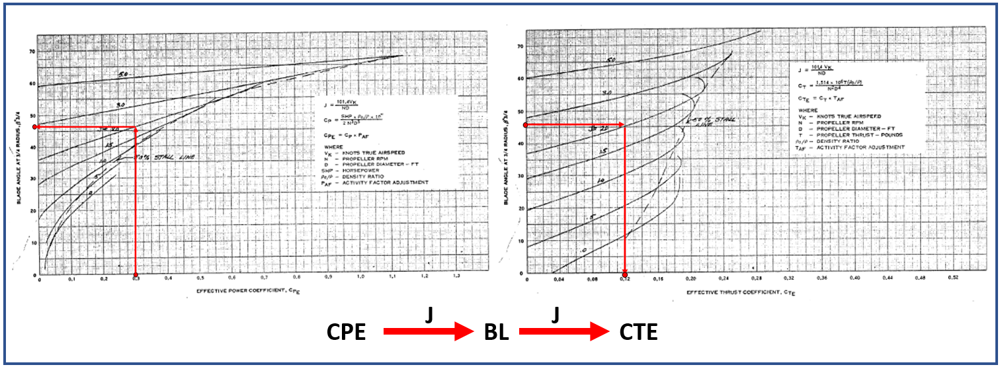
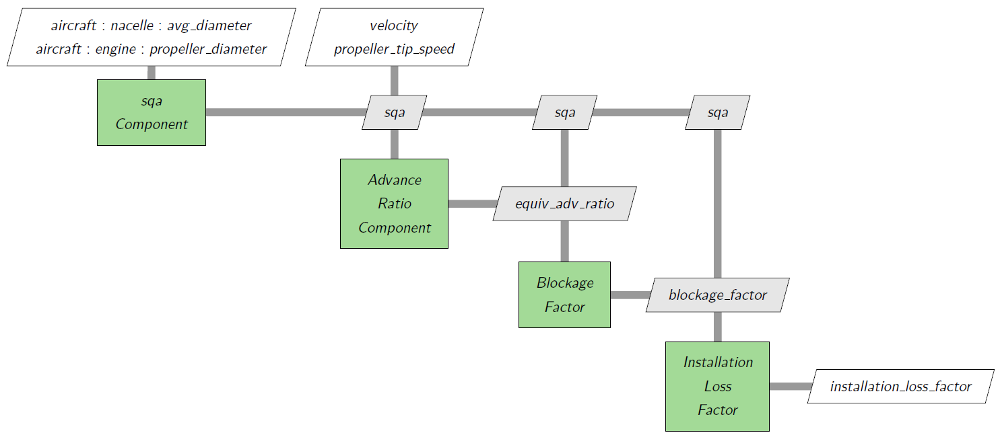

# Hamilton Standard Propulsion Model

In the 1970s, NASA contracted Hamilton Standard to forecast into the future mid-80s to the 90s what they thought advanced propellers would look like. They took existing data and projected into the future. The result is what we call “Hamilton Standard model” today. The Hamilton Standard Documentation is publicly available on NTRS: [19720010354.pdf(https://ntrs.nasa.gov/api/citations/19720010354/downloads/19720010354.pdf) (nasa.gov). You can find the definitions, methodology, and Fortran code in the doc. In Aviary, we implement only one of the options, namely, for a given horsepower, it computes the corresponding thrust.

Below is an XDSM diagram of Hamilton Standard model:


The inputs are grouped in three aspects:

Geometric inputs:
- Propeller diameter
- Activity factor per blade (range: 80 to 200, baseline: 150)
- Number of Blades (range: 2 to 8)

Power inputs:
- Shaft Horsepower to Propeller (hp)
- Installation Loss Factor (0 to 1)

Performance inputs:
- Operating Altitude, ft
- True Airspeed, knots
- Propeller Tip Speed (Usually < 800 ft/s) 
- Integrated Lift Coefficient (range: 0.3 to 0.8, baseline: 0.5)

Note that some of the inputs are good for limited ranges. The Hamilton Standard model can have odd number of blades although the data provided are based on even number of blades. For odd number of blades, interpolations using 2, 4, 6 and 8 blade data are used. The corresponding outputs are:

Geometric outputs:
- Design Blade Pitch Angle (@0.75 Radius)

Power outputs:
- Installation Loss Factor
- Tip Compressibility Loss Factor
- Power Coefficient
- Thrust Coefficient (rho=const, no losses)

Performance outputs:
- Flight Mach number
- Propeller Tip Mach number
- Advance Ratio
- Tip Compressibility loss factor
- Thrust
- Propeller Efficiency with compressibility losses
- Propeller Efficiency with compressibility and Installation losses

As shown in the above XDSM diagram, the model is an OpenMDAO group that is composed of four components and one subgroup: 

- `USatmos`
- `PreHamiltonStandard`
- `HamiltonStandard`
- `InstallLoss`
- `PostHamiltonStandard`. 

`USatmos` component provides the flight condition. The flight condition is passed to `PreHamiltonStandard` component from which flight Mach number, propeller tip Mach number, advance ratio and power coefficient are computed. They are fed into `HamiltonStandard` component.



HamiltonStandard is the core of the model. Given the power coefficient (CP) and advance ratio (J), it finds the blade angle (BL) by a CP-BL chart by tracing advance ratio and then with the blade angle, it finds the thrust coefficient (CT) using its CT-BL chart by tracing advance ratio again. This algorithm is shown in the above pair of charts. The CP → BL → CT chart matching algorithm is based on baseline data. If user inputs are not on baseline, it will first convert them to those baseline parameters by a sequence of interpolations to do corrections. The newly converted parameters are called “effective parameters” (e.g., CPE and CTE). The outputs are blade angle, thrust coefficient and tip compressibility loss factor.

Finally, the thrust is computed in `PostHamiltonStandard` component based on thrust coefficient and tip compressibility loss factor.

Hamilton Standard model uses a bunch of wind tunnel test data from un-installed propellers. When a cell is mounted around the propeller, an installation loss factor is introduced. The installation loss factor can be given by user or computed. If it is computed, we need another group of components as shown below:



This diagram is represented by `InstallLoss` group in the first diagram. Note that nacelle diameter is needed when installation loss factor is computed. We use the average nacelle diameter.

The newly added aviary options and variables are:

```
Aircraft.Engine.PROPELLER_DIAMETER
Aircraft.Engine.PROPELLER_INTEGRATED_LIFT_COEFFICENT
Aircraft.Engine.PROPELLER_ACTIVITY_FACTOR
Aircraft.Engine.NUM_BLADES
Aircraft.Design.COMPUTE_INSTALLATION_LOSS
Dynamic.Mission.PROPELLER_TIP_SPEED
Dynamic.Mission.SHAFT_POWER
Dynamic.Mission.INSTALLATION_LOSS_FACTOR
```

To build a turboprop engine and an Aviary model, we use `TurboPropDeck` object with a special parameter `prop_model` set to `True`:

```
engine = TurboPropDeck(options=options, prop_model=True)
```

Some inputs are options:

```
options.set_val(Aircraft.Engine.PROPELLER_DIAMETER, 10, units='ft')
options.set_val(Aircraft.Engine.NUM_BLADES, val=4, units='unitless')
options.set_val(Aircraft.Design.COMPUTE_INSTALLATION_LOSS, val=True, units='unitless')
```

We set the inputs like the following:

```
prob.set_val(f'traj.cruise.rhs_all.{Dynamic.Mission.PROPELLER_TIP_SPEED}', 750., units='ft/s')
prob.set_val(f'traj.cruise.rhs_all.{Aircraft.Engine.PROPELLER_ACTIVITY_FACTOR}', 150., units='unitless')
prob.set_val(f'traj.cruise.rhs_all.{Aircraft.Engine.PROPELLER_INTEGRATED_LIFT_COEFFICENT}', 0.5, units='unitless')
```
